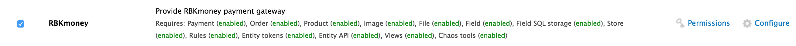
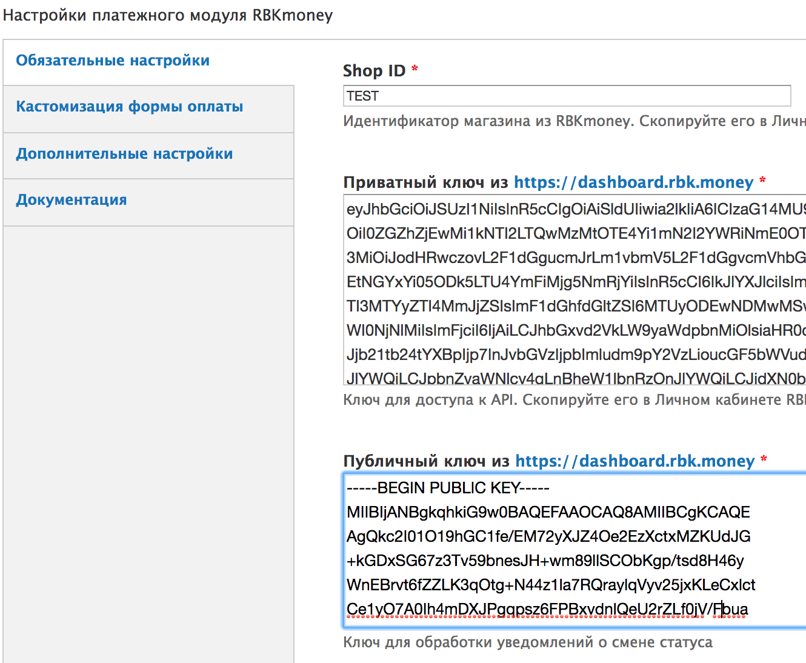
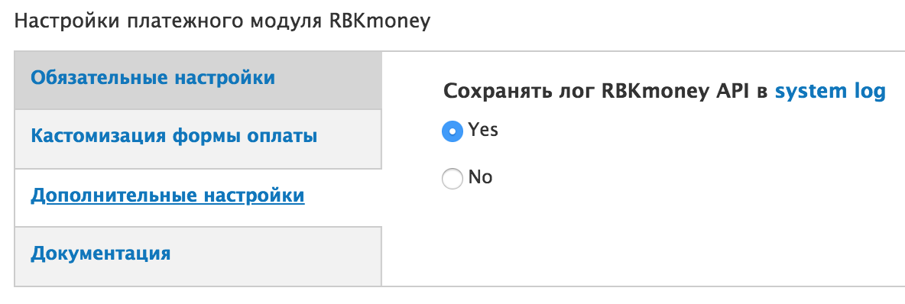
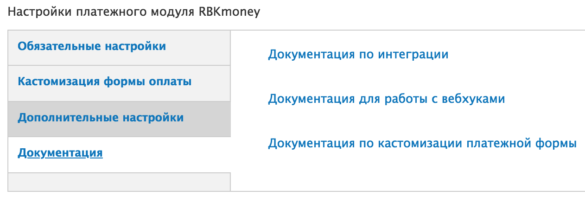

# Drupal rbkmoney_checkout_ubercart module

Модуль оплаты `rbkmoney_checkout_ubercart` необходим для интеграции с сервисом [RBKmoney](http://rbk.money/) на базе CMS Drupal и компонента [Drupal ubercart](https://www.drupal.org/project/ubercart).

Пожалуйста, обязательно делайте бекапы!

Модуль разрабатывался и тестировался:

- Drupal версия `7.x`;
- Компонент `Ubercart 7.x-3.10`
  - ctools-7.x-1.9
  - entity-7.x-1.7
  - jquery_update-7.x-2.7
  - rules-7.x-2.9
  - views-7.x-3.14

#### Требования

- PHP 5.4 (минимум)
- OpenSSL - 1.0.2k-fips (минимум)
- Curl

### Установка и настройка модуля

Модуль находится в папке `rbkmoney_checkout_ubercart`

1. Установка. Копируем папку с модулем в каталог `/sites/all/modules`
2. Включаем модуль на странице `/admin/modules`, раздел **Ubercart - payment**

3. Настройка осуществляется по адресу `/admin/store/settings/rbkmoney_checkout_ubercart`

На вкладке "Обязательные настройки"

`Shop ID` - идентификатор магазина из RBKmoney.
Скопируйте его в Личном кабинете RBKmoney в разделе `Детали магазина`, поле `Идентификатор`;

`Приватный ключ` - ключ для доступа к API.
Скопируйте его в Личном кабинете RBKmoney в разделе `API Ключ`

`Публичный ключ` - ключ для обработки уведомлений о смене статуса
- Заходим в личный кабинет RBKmoney: `Создать Webhook`;
- Вставляем в поле URL вида `https:/<your-site>/rbkmoney_checkout_ubercart/callback/result`
- Выбираем Типы событий `InvoicePaid` и `Invoice Canсelled`;
- после создания Webhook-а копируем `Публичный ключ` после нажатия `Показать детали`;
скопированный ключ вставляем в поле `Публичный ключ` на странице настроек модуля;

На вкладке "Кастомизация формы оплаты"

Можно изменить название кнопки, ее стиль, добавить название магазина и его описание 

На вкладке "Дополнительные настройки"

Включаются или отключается логирование, посмотреть сами логи можно по пути `#overlay=admin/reports/dblog`

На вкладке "Документация"

Можно ознакомиться с ссылками на документацию

### Нашли ошибку или у вас есть предложение по улучшению модуля?

Пишите нам support@rbkmoney.com
При обращении необходимо:
* Указать наименование CMS и компонента магазина, а также их версии
* Указать версию платежного модуля (доступна в списке меню `Модули`)
* Описать проблему или предложение
* Приложить снимок экрана (для большей информативности)
